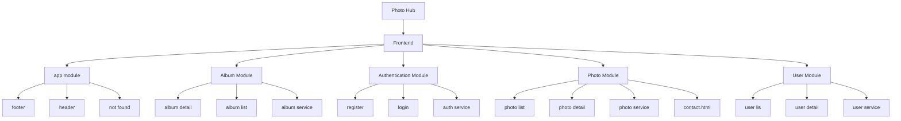
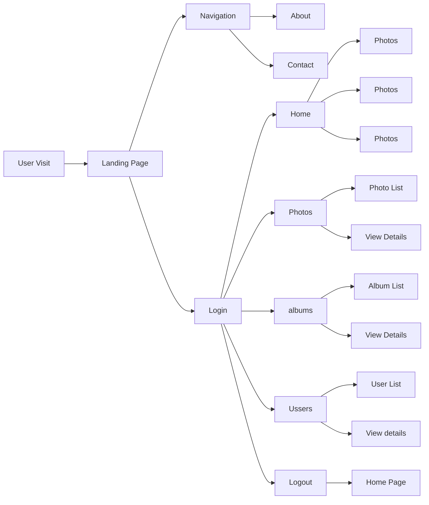

# PhotoSphere
This project was generated with [Angular CLI](https://github.com/angular/angular-cli) version 17.3.11.

## 1. INTRODUCTION
This project, titled PhotoHub, was developed as part of the Savannah Informatics Frontend Engineer Assessment. PhotoHub is a responsive, web application designed to manage and view user information, albums, and photos. The application integrates an Angular-based frontend with a Node.js backend for authentication, while user, album, and photo data is dynamically fetched from the JSONPlaceholder API.( https://jsonplaceholder.typicode.com/)

## 2. TECHNOLOGIES USED
## Frontend-
Framework: Angular version 17.3.11
Stacks: HTML5, CSS3, TypeScript

## Database:
 MySQL for authentication(Database Name =savannah, table=user), 
The rest of the data is fetched from https://jsonplaceholder.typicode.com/

## Other libraries/tools:
 Angular Material UI library, Bootstrap

## 3. PROJECT SETUP
## a. Prerequisites
Node.js (version 18.13.0 or higher)
npm (version 10.3.0 and above): comes with Node.js
MySQL Database: Ensure a MySQL server is running locally

## b.  Frontend Setup
1. Clone the Repository from GitHub: 
git clone https://github.com/SAVANNAH-INFORMATICS/PhotoHub.git

2. Install Dependencies all required packages for the Angular application using: 
npm install or npm install --force

3. Run the Application to start the Angular development server:
npm run or ng serve

The application will be accessible at http://localhost:4200

4. Build for Production
npm run build
The build files will be available in the dist/ directory

## c. Backend Setup
1. Navigate to the backend directory
using the cd../savannah-backend  command

2. Install dependencies/all required packages for the Node.js server using:
npm install or npm install --force

## d. Database Configuration
Ensure the MySQL server is running
Create a database named savannah and a table named user using the following schema:

CREATE DATABASE savannah;
USE savannah;

CREATE TABLE user (
  id INT AUTO_INCREMENT PRIMARY KEY,
  full_name VARCHAR(100) NOT NULL,
  email VARCHAR(100) UNIQUE NOT NULL,
  password VARCHAR(255) NOT NULL
);

## f. Run the backend server
Start the Node.js server:
npm start
The backend API will be accessible at http://localhost:8080.

## 4. APPLICATION STRUCTURE
## a. Frontend

## Modules:
Main Module, 
Authentication Module, 
Dashboard Module,
Users Module, 
Photos Module, 
Albums Module, 
Material Module,
Shared Module, 
CoreModule Module

## Authentication Module:
Has two major components, register and login.
Register Component: 
Name, email, password.
Login Component:
email and password.

## Album Module:
Has two major components, album-list and album-detail.
Album-list: Lists the available albums.
Album-detail: User can view album details.

## Dashboard Module
Has four main components: About, Home, Contact and landing page

## Photo Module:
Has two major components, photo-list and photo-detail.
Photo-list: Lists the available photo.
Photo-detail: User can view photo details and update photo title.

## Photo Module:
Has two major components, user-list and user-detail.
User-list: Lists the available users.
User-detail: User can view user details.

## Material Module
Contains shared Angular Material UI dependency modules

## Main Module
Has three components: Footer, Header and not-found

## Services
AuthService, UserService, PhotoService,AlbumService

## Environemets
Has both production and development environments

## Project Architecture

## User Experience Flow Chart

## 5. API DETAILS

## Authentication APIs
Login: "http://localhost:8080/user/login", : Authenticate a user
Register: "http://localhost:8080/user/signup" : Register a new user

## Users API
 usersApiUrl:  "https://jsonplaceholder.typicode.com/users"
Fetch all users: GET/usersApiUrl 

## Albums API
 albumsApiUrl:  "https://jsonplaceholder.typicode.com/albums"
 Fetch all albums: GET/albumsApiUrl
 Fetch albums for a specific user: GET/albumsApiUrl/:userId

 ## Photos API
  photosApiUrl:  "https://jsonplaceholder.typicode.com/photos"
  Fetch all photos: GET/photosApiUrl
  Update photo title/details: PUT/photoApiUrl/photoId

## 6. TESTING
Testing ensures the reliability and robustness of the PhotoHub application. This section outlines the tools, frameworks, and steps used to test the frontend and backend components.

## Testing tools and frameworks:
Jasmine- A testing framework for writing unit tests in Angular Applications
Karma - A test runner used to execute unit tests in multiple environments
Postman: Used for testing backend APIs

## Build

Run `ng build` to build the project. The build artifacts will be stored in the `dist/` directory.

## Running unit tests

Run `ng test` to execute the unit tests via [Karma](https://karma-runner.github.io).

## Running end-to-end tests

Run `ng e2e` to execute the end-to-end tests via a platform of your choice. To use this command, you need to first add a package that implements end-to-end testing capabilities.

